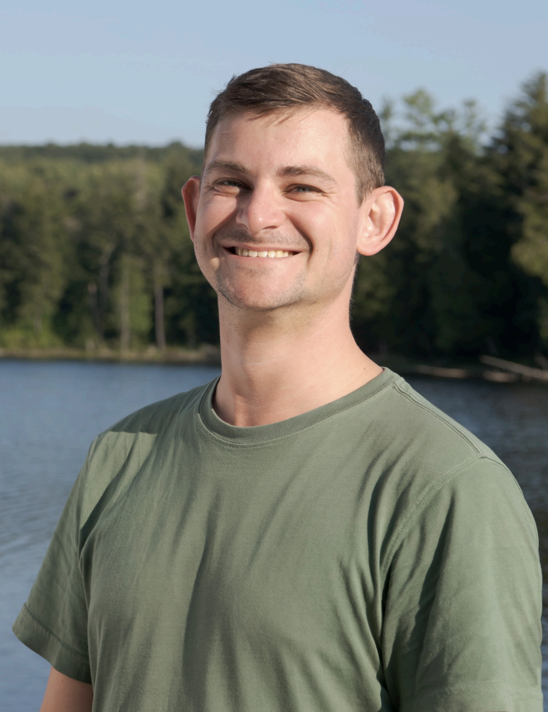

<link rel="shortcut icon" href="images/site_logo_white.png" />

<style type="text/css">
.title {
  display: none;
}

#getting-started img {
  margin-right: 10px}

</style>

<div class="row" style="padding-top: 30px;">
<div class="col-sm-6">

# **Home**

I am an environmental professional specializing in ecology, ecological restoration, and data analysis. Currently, I am working to identify areas that are disproportionately important for biodiversity conservation in Canada through my [work on the Key Biodiversity Areas Project](https://kbacanada.org/) with [Wildlife Conservation Society Canada](https://www.wcs.org/). I also volunteer with the [Society for Conservation Biology North America (SCB-NA)](https://scbnorthamerica.org/) and I teach courses in the Ecological Restoration and Environmental Technician programs at [Niagara College Canada](https://www.niagaracollege.ca/). I additionally take on data consulting work here or there for specific and interesting projects, so please get in touch if you'd like to work together. 


## My Specialities

- Scientific Study Design, Implementation, and Reporting
- Ecological Monitoring, Mapping, and Assessment
- Ecological Restoration Planning, Implementation, and Assessment
- Data Analysis Using R Statistical Programming and Geographic Information Systems (GIS)
- Database Design Using Microsoft Excel, Access, SQL
- Technical Reporting
- Non-profit Governance and Administration
- Outdoor Education and Outreach


</div>
<div class="col-sm-6">


</a>
</div>
<div class="header">

Last Updated: 
```{r,results="asis",echo=F} 

cat(format(Sys.time(),"%c"))
```
[GitHub Source](https://github.com/zacharymilosmoore/zacharymilosmoore.github.io)
</div>
